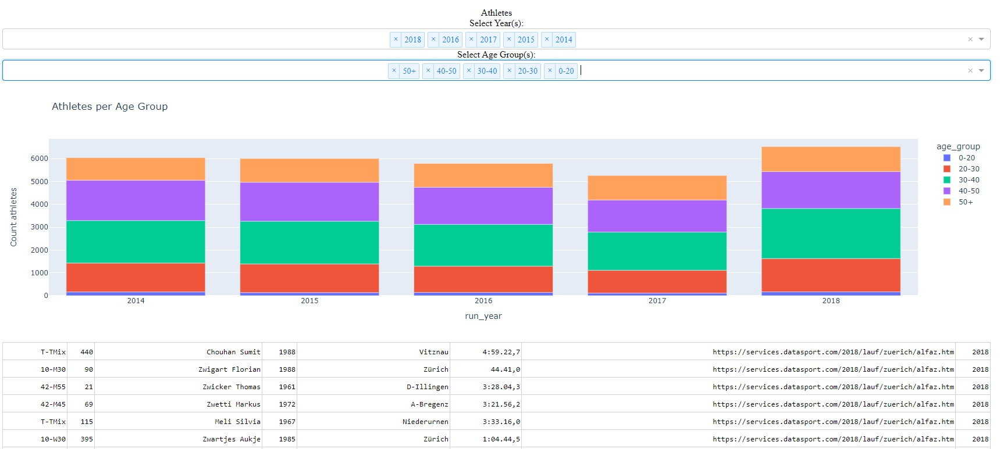

# Runners insights

## Description

This project extracts the infomrmation about Zurich marathon runners from Datasport and provide visualization split per age group and marathon year.
It features:
- a web parsting agent ```./webparser/parser.py``` 
which scrapes the data for Zurich marathon runners for 2014-2018
- a dashboard ```./visualization/app.py``` which visulizes runners per age group and marathin year


### Setting Up Your Environment

1. **Clone the repository**:

   ```bash
   git clone https://github.com/yourusername/your-repo.git
   ```
2. **Install dependencies**:
   ```bash
   pip install -r requirements.txt
   ```
3. **Run data parsing**:
   ```bash
   cd webparser
   python3 parser.py
   ```

4. **Lauch the dashboard**:
   ```bash
   cd ..
   cd visualization
   python3 app.py
   ```